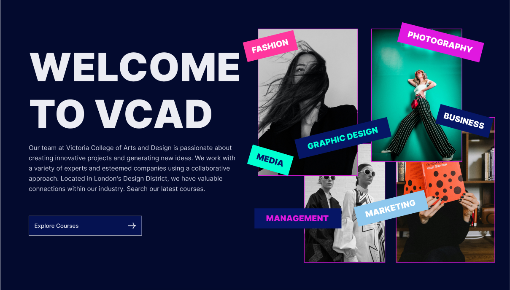

# Victoria College

Live demo: https://victoria-college-coral.vercel.app



Victoria College is a modern Next.js landing and course-focused website designed to present the school’s campus, courses, testimonials, and academic value in a polished, conversion-friendly way.

## How to run it locally

First, check whether Node.js is installed:

```bash
node -v
npm -v
```

If Node.js is not installed, install it with:

```bash
winget install OpenJS.NodeJS.LTS
```

Then run the app:

```bash
npm install
npm run dev
```

Open http://localhost:3000 in your browser.

If you want a production build instead:

```bash
npm run build
npm run start
```

## How far we got and what we prioritised

The project already includes the main landing page structure, course sections, campus and partner content, testimonial blocks, and a responsive visual style. I focused on the parts that matter most for a first impression: clear navigation, strong hero messaging, course discovery, and a professional visual layout that feels credible and modern.

I also used Framer Motion to add subtle movement and interaction, which helps the site feel more alive without making it heavy or distracting. The app is built in Next.js with reusable components and a content-driven structure, so it is easy to extend as the college grows.

## One decision beyond the design

One change I made that was not explicitly in the design was adding motion-driven transitions using Framer Motion. I did this because the page needed a bit more personality and polish to feel premium, especially on the hero, cards, and section reveals. The motion is subtle enough to keep the experience professional while still making the interface feel more dynamic.

## What I would do next with more time

Given more time, I would expand the site with additional pages, build out a full course application flow, and add an admin dashboard for managing courses, application. I would also improve the CMS/content structure and strengthen the application experience so the site becomes more than a marketing page and turns into a complete student application platform.
